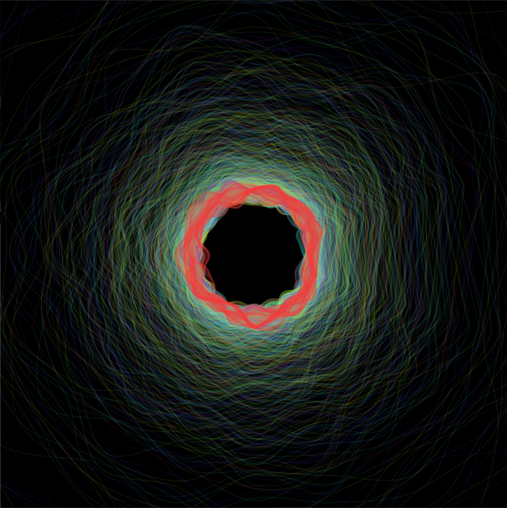

## Our objective:
As lovers of all things music and Python, we wanted to find a way for people to visualize audio easily in a format that is both pleasing to the eye and meaningful.

*The audio for this visualization can be found [here.](https://bit.ly/3o48JSg)*

## What we did: 
We created a program that processes a user inputted .mp3 file, extracts a few key audio features from the file, and maps these features to various characteristics of a [perlin noise flower](https://www.benfrederickson.com/flowers-from-simplex-noise/) that is generated(example of this visual can be seen above).

## How does it all work? 
When processing an audio file and generating the flower, our program extracts data representing: 
* The beat onset and onset strength of the song 
  * The beat onset data determines when a ring of the perlin flower is drawn, meaning that for every 'beat' detected in the song, a ring is drawn.
  * The beat onset strength data determines how large each ring is based on how strong each beat is within the song 
* The pitch class of all of the harmonic components of the inputted song
  * The pitch class data is a dataset representing the most prominent notes at thousands of points during the song; these notes are mapped to colors for the rings. 

*Visualization of [comments from Rick Miller](https://www.youtube.com/watch?v=YQwTeIsjNfM)*

## Some tools that we used for this
We researched many musical, visual, and data manipulation and storage Python libraries, however we decided on using these specific libraries:
* [Librosa](https://librosa.org/doc/main/index.html)
  * We use Librosa to process audio and pull out the necessary data
* [Processing-py](https://py.processing.org/)
  * Processing is used to generate the perlin flower visual
* [Youtube-DL](https://youtube-dl.org/)
  * Youtube-Dl allows us to download youtube videos from their link 
* [Perlin-Noise](https://pypi.org/project/perlin-noise/)
  * Perlin-Noise is used to generate the perlin noise for the flower
* [tqdm](https://pypi.org/project/tqdm/)
  * tqdm provides the user with a progress bar for the art generation

## How you can use it! 
Installation and usage instructions can be found in the usage section of the [README](https://github.com/olincollege/video-synth#usage) file of our repository. Once you install our repository you will also need to install all of the external libraries mentioned in the readme. After this use the terminal commands described in the readme to start visualizing audio. Make sure to read the instructions in the readme first, then you can install all of the files necessary by going to our [repository](https://github.com/olincollege/video-synth) and cloning it, or clicking the link below!

<a href="video-synth-main.zip">Download .zip file</a>

*Visualization of [a cover of Daft Punk's Harder, Better, Faster, Stronger](https://youtu.be/RHu0ALxqUIo)*

## About the creators: 
We are two engineering students in the class of 2024 at Olin College of Engineering. We took on this project as an oppurtunity to explore signal processing in python, interactive programs, and generative art. Our github profiles can be found below. 

[mstopyra](https://github.com/mstopyra)
[RohithTatineni](https://github.com/RohithTatineni)

